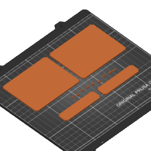

# Drawer Divider

This is my version of 3D printer drawer dividers with parametric sizes and a
system of connecting them using lego-like pieces with pins.

I am using OpenSCAD to develop the system and generate the STL, PrusaSlicer to
generate the GCode, my script 3MF-zip-dir to conver the PrusaSlicer project file
into a directory (so it is fit for version control) and Prusa MK3S to 3D print
the parts.
